# Tutorial 3: Writing publications with Overleaf (Work in progress)

This tutorial in the context of the **Reproducible Research Workshop** provides you with the first steps on how to write publications in Overleaf.

**Objectives of this tutorial:**

* Subscribe to Overleaf
* Create a new Latex project in Overleaf
* Save your Overleaf project to your local computer
* Share your project with colleagues

## Motivation
Overleaf is an online LaTeX editor with integrated real-time preview. 
It allows you to collaborate with your co-autors who can review, comment, and edit the document.
Your project is compiled in the background and you can see what it looks like right away.
It offers a rich text mode for those who do not like to work directly in the LaTeX code.

## Part 1: Subscription

**1. Sign up:** To get started you need to sign up for Overleaf on the **[Overleaf webpage](https://www.overleaf.com/)**.

**2. Sign in:** Once you have signed up, you can log into your account. The first time you sign in, you need to verify your e-mail address and to set a password.

## Part 2: Create a new project
**1. Create project:** You can now create your first project by pressing on the "create a new project" button. A window will pop up providing you with a choice of possible templates. For now, we choose the blank paper under the heading basics.

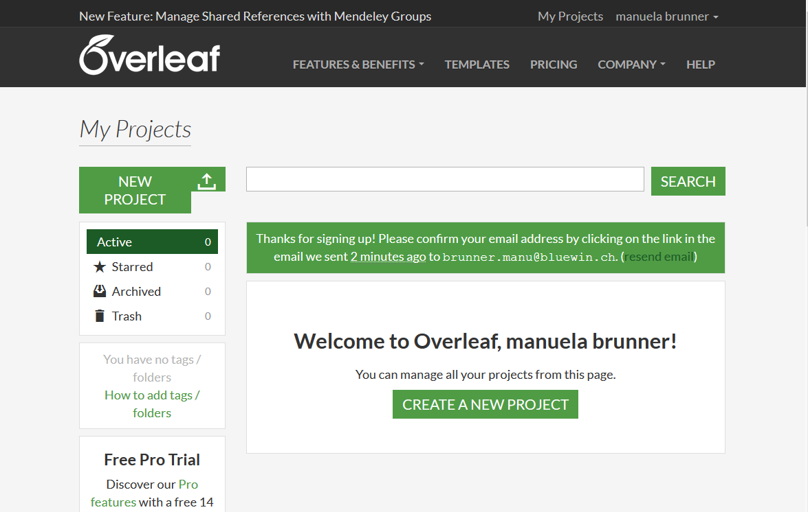

A new window opens containing your new project.

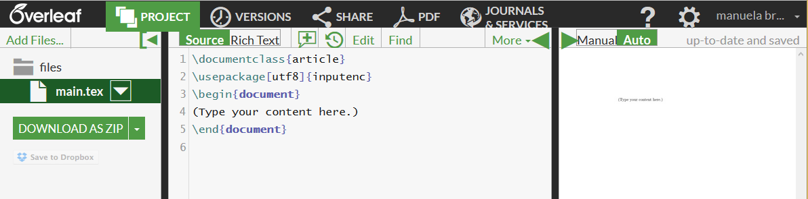

The working surface is composed of three areas: 
* The area to the left where you manage the files being part of your document (tex file, bibliography, figures,...) and where you can download your project as a zip-file;
* The part in the middle showing the tex file containing your LaTeX code;
* and the part to the right where your document is displayed as a pdf after compilation (which is done automatically).

**2. Upload your own tex-file:** Currently, your document just consists of a blank file. However, we would like to continue working on the document you created in Tutorial 2: Writing publications with R. 
The easiest way to upload a new tex file is to upload it from your local computer. To do so, click on the add files button in the upper left corner and choose upload from computer.

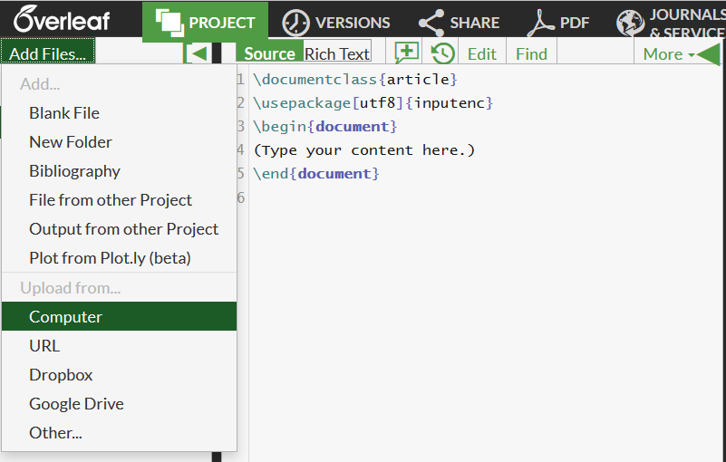

You can either drag your file (which you probably called publication.tex) to the uploading window opening or choose a file via the CHOOSE FILES button.

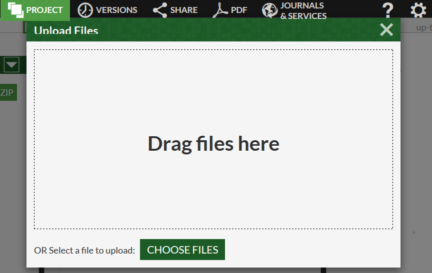

To make it your main tex file, you need to delete the existing file main.tex. This will make your publication.tex file the new main tex file. Overleaf will now try to compile your document. This will produce an error as indicated by the red square in the upper right corner.

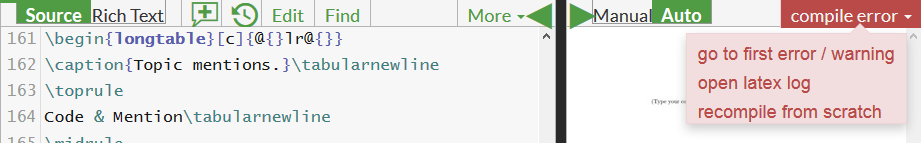

When you click on "go to first error", Overleaf will indicate you where in your tex file the error is caused. In our case, it is unable to load a picture you want to call from a pdf file. For Overleaf to find it, we need to add it and all other external files that are called in the main tex file to our files as well.
To do so, click on the add files button in the upper left corner again and upload all figures used.
Once you have uploaded all figures referenced to in the tex-file, Overleaf will compile a pdf of your document.

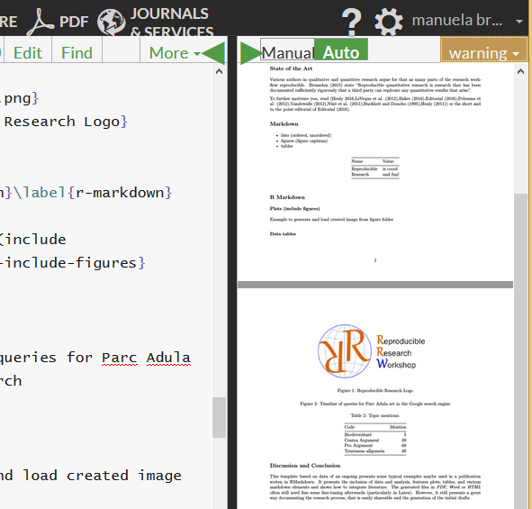

**3. Add bibliography:** Overleaf allows you to connect to your bibliography.

Several reference managing systems are supported such as citeulike, Zotero, or Mendeley.

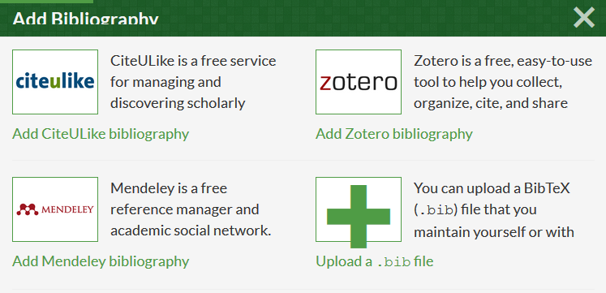

Just check whether your preferred one is available as well.

## Part 3:  Modification of document

**1. Add and modify content:** Now it is time to make changes to your document. Add text, figures, tables, lists,...
You can either work directly in the source code or switch to rich text if you are not that familiar with the LaTeX language.
To do so, just click on the button Rich instead of Source.

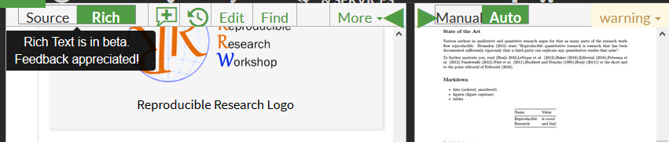

Under the menu More, you find some commonly used commands such as adding paragraphs, printing bold and italic, adding lists, ...

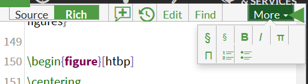

**2. Look at file history:** After having made some changes to the document, you might want to look at the file history of your document. This allows you to keep the overview on when and how you have made changes.

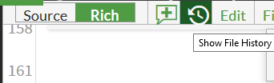

If you are not happy with some of the changes made, you can restore an older version of the document by clicking on resotre file.

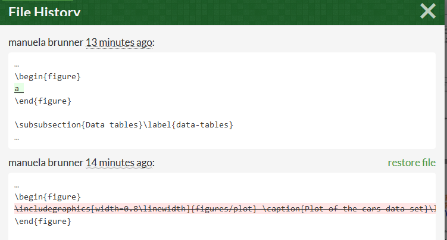

This will bring you back to an older version.
You can also save certain versions of your document by clicking on the VERSIONS button. This allows you to attach a label to your version.

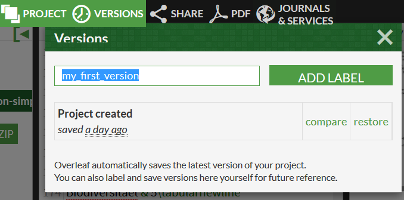

**3. Add comment:** Overleaf allows you to comment what you have written. This allows you to set reminders for yourself or to communicate with your co-authors and collaborators.
You can add a comment by clicking on the plus sign in the menu. This will open a window where you can add a comment.

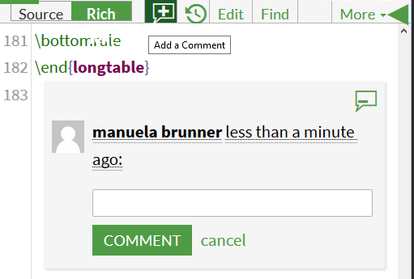

## Part 4: Saving your project

You can save your document as a pdf by clicking on the menu PDF.

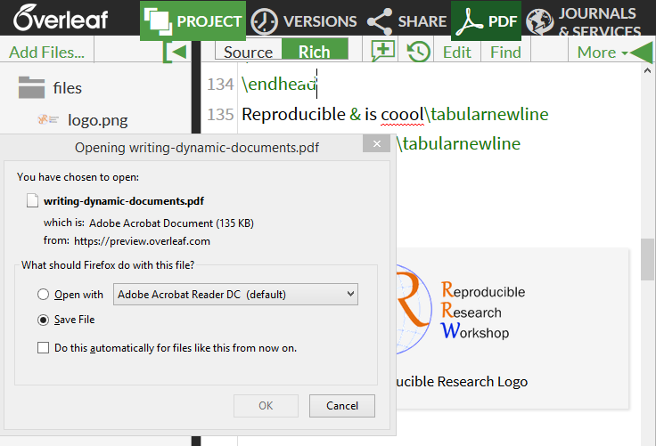

If you would like to save the whole project including tex file and figures, you can download it as a ZIP-file.

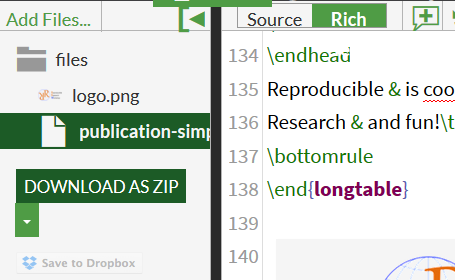

## Part 5: Sharing of document

You can share your project with others via a link. You can find this link by clicking on the menu SHARE.

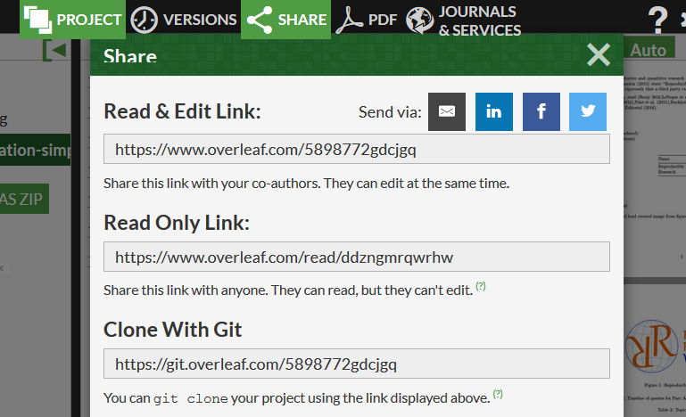

You can send this link to your co-authors to allow them to make changes to the document as well.

## Templates: 

Most journals offer their own Latex templates which can usually be downloaded on their webpage.
